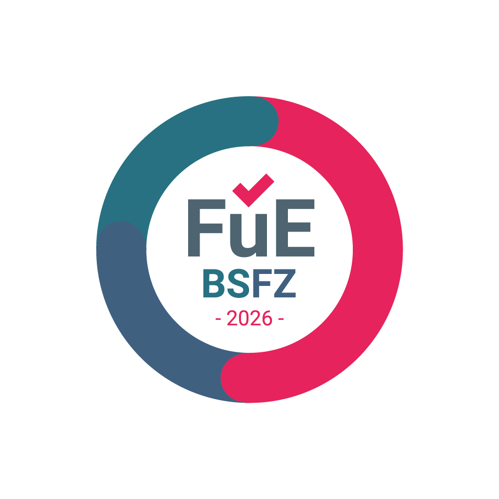

# Adam Koch · *DeiFlagellum*

Software engineer and applied-cryptography researcher with about 30 years in IT. I build
products end to end — protocols and cryptography, Windows and Android apps, web platforms and
the servers they run on — and I document my research openly, negative results included.

📫 kontakt@advena-partners.com · 🔬 [koch-laboratory.com](https://koch-laboratory.com) · 🧾 [sigelith.org](https://sigelith.org) · 🛠️ [w3x.site](https://w3x.site)

---

## Certified research and development

In 2026 the **Bescheinigungsstelle Forschungszulage (BSFZ)** certified nine of my projects as
research and development under Germany's Research Allowance Act (FZulG):

- **Metadata-resistant, account-less communication — [Ygoow](https://ygoow.com)** (seven
  projects): post-compromise security without a stateful server · post-quantum hybrid key
  exchange (X25519 + ML-KEM) · a metadata-resistance layer · address-less rendezvous with epoch
  rotation · coordinator-free healing of group epochs · a deniable store with a hidden volume ·
  conditional access with a quorum.
- **Forecasts with measured own fallibility** (two projects): measurement studies on
  machine-generated statements.

*Das BSFZ-Siegel bescheinigt Unternehmen, die mindestens einen positiven Bescheid durch die
Bescheinigungsstelle Forschungszulage (BSFZ) erhalten haben, ihre FuE-Tätigkeit.*

How I work and what came out of it — problem, hypothesis, falsifiable criterion, result:
[koch-laboratory.com](https://koch-laboratory.com).

---

## Open source

| | |
|---|---|
| [**sigelith-desktop**](https://github.com/DeiFlagellum/sigelith-desktop) | Windows client for the Sigelith proof-of-existence log: stamp files without uploading them, verify proofs offline, watch the log's witnesses, hand over files with proof of delivery. Apache-2.0 · [Microsoft Store](https://apps.microsoft.com/detail/9n5xk65gtf33) |
| [**sigelith-backup**](https://github.com/DeiFlagellum/sigelith-backup) | Versioned, optionally encrypted backups with per-file time proofs, content audits against the public log and time capsules. GPL-3.0 |
| [**beat-key**](https://github.com/DeiFlagellum/beat-key) | Key server for time-sealed envelopes (`beattime-seal-v1`), in Go |
| [**sigelith-log**](https://github.com/DeiFlagellum/sigelith-log) | Independent, immutable weekly copies of the log's signed checkpoints |

## Products

| | |
|---|---|
| [**Sigelith**](https://sigelith.org) | Public, free proof-of-existence infrastructure — timestamping, verification, proof of delivery and time-sealed capsules — plus Internet Time (@beat) |
| **BeatTime** | @beat clock for Android with widget faces and a Wear OS watch face (Google Play) |
| [**Ygoow**](https://ygoow.com) | Metadata-resistant, account-less messenger |
| [**DosePeer**](https://dosepeer.com) | Private GLP-1 tracker with community data — Django + Flutter (Google Play) |
| **Kursownia** | Mobile course platform: creators run paid video courses in branded spaces |
| **TrainHub.fit** | Platform for personal trainers — Django, DRF, Channels, Celery |
| [**Konveria**](https://konveria.com) | Public site and client portal for a Polish-German consultancy — Django 5.2, PostgreSQL, Celery |
| **Nearstadt** | Free promotion of local shops |
| **Laborbuch** | R&D record-keeping built to convince someone who does not trust its author; powers koch-laboratory.com |
| **NeuroScreen** | Cognitive screening with a consumer EEG headband (Web Bluetooth), a marker-annotated film and age norms |
| **TimeVault** | Time capsules, inheritance and conditional access |
| **LottoLab** | Draw database, statistics and prediction desktop app (Qt) |
| **Trend bot** | Trend-following crypto trading on Kraken — backtest, paper and live modes |

## Research lines — [Koch Laboratory](https://koch-laboratory.com)

Time as evidence · records that convince a sceptical reader · verifiable time in a system that
cannot see the content · cryptography of time, inheritance and conditional access ·
structure-first compression · image moderation without storing images · low-cost cognitive
screening with consumer EEG · provably-secure steganography over a generative channel ·
resilient urban IoT networks (LoRa mesh) · forecasts with measured own fallibility

## Stack

Python (Django, PySide6/Qt) · Dart/Flutter · Go · JavaScript · PostgreSQL · Celery · Docker · Caddy · Linux

Cryptography in production: Ed25519 · X25519 / ML-KEM · AES-256-GCM · Argon2id · BLS12-381 (drand, IBE) · Merkle trees · OpenTimestamps

## Brands

[**W3X**](https://w3x.site) — development studio · [**Advena Partners**](https://advena-partners.com) — brand portfolio ·
[**Konveria**](https://konveria.com) — Polish-German consulting · **Deiflagellum** — my music project, and the name behind this account
